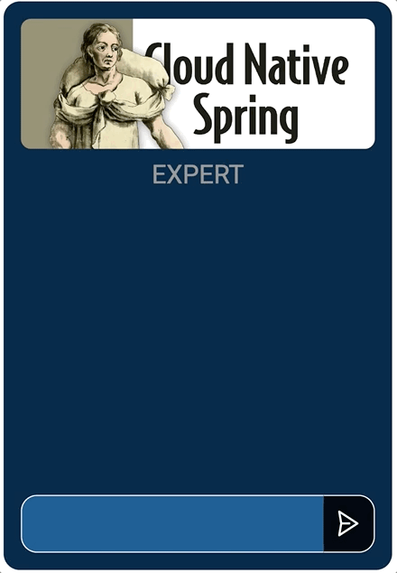
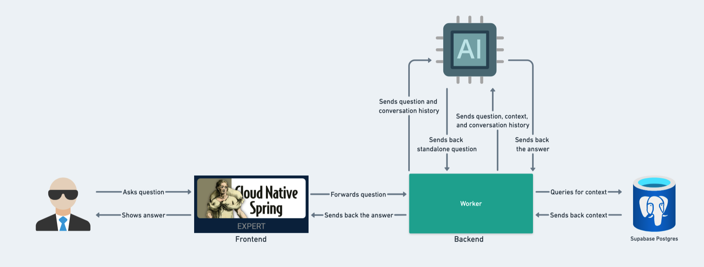

# Cloud Native Spring Expert
✨ An AI-powered app that answers questions based on the book Cloud Native Spring in Action. It is powered with OpenAI, LangChain, RAG, and Supabase. The app is built for personal, non-commercial, and educational purposes.

📕 I highly recommend you buy and read [the book](https://www.manning.com/books/cloud-native-spring-in-action). It's an excellent book that strengthens your knowledge and experience in cloud native, Spring Cloud, DevOps, Kubernetes, GitHub Actions, and many more.

## In This Document:
  - [Live Application URL](#live-application-url)
  - [System Design](#system-design)
  - [Repositories](#repositories)
  - [How to Use the Application](#how-to-use-the-application)
  - [Technologies Used](#technologies-used)
  - [Future Features:](#future-features)
  - [Challenges and Learning Points:](#challenges-and-learning-points)

## Live Application URL
[https://cloudnativespringexpert.pages.dev/](https://cloudnativespringexpert.pages.dev/)

## System Design

## Repositories:
1. [Web client repository](https://github.com/shantdashjian/cloud-native-spring-expert-client)
2. [Cloudflare worker repository](https://github.com/shantdashjian/cloud-native-spring-expert-worker)
   
## How to Use the Application
   
1. The learner asks a question related to Cloud Native Spring and DevOps by typing it in the input field.
2. They hit ENTER or click on the arrow button.
3. The App responds with an answer based on the infomration in the book.

## Technologies Used
1. HTML, CSS, and JavaScript.
2. OpenAI API.
3. LangChain.
4. Supabase.
5. RAG: Retrieval Augmented Generation.

## Future Features:
1. Make the UI responsive.

## Challenges and Learning Points:
1. I practiced splitting the code into a frontend client and a backend worker and deploeyd both to Cloudflare.
   

[Up](README.md)
